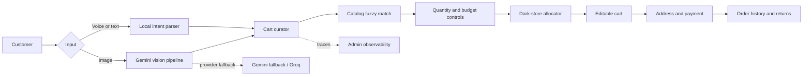
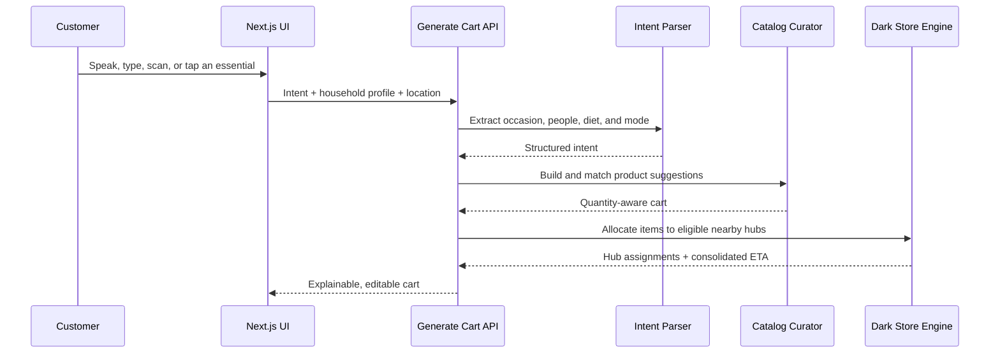

<div align="center">

# Amazon Intent

### Urgent shopping, resolved from intent to checkout in seconds

[](https://amazon-intent.vercel.app)
[](https://nextjs.org/)
[](https://www.typescriptlang.org/)
[](#quality-gates)
[](LICENSE)

**Speak it. Scan it. Describe the outcome. Amazon Intent builds, sources, and prepares the cart.**

[Explore the live product](https://amazon-intent.vercel.app) | [Review the architecture](#system-architecture) | [Run locally](#local-development)

</div>

---

## The Challenge

> **Amazon Now: Reimagining Urgent Shopping**
>
> Quick-commerce customers arrive with an immediate need and expect to complete a purchase within seconds. Traditional search, browsing, comparison, and manual cart construction introduce friction precisely when speed matters most.

Amazon Intent changes the starting point of commerce from **"Which product are you searching for?"** to **"What are you trying to accomplish?"**

A customer can say:

```text
I need snacks for a movie night for five.
```

The system interprets the occasion, calculates quantities, selects relevant products, checks nearby fulfillment capacity, and produces an editable cart with a consolidated delivery estimate.

## Product Principles

| Principle | Product behavior |
|---|---|
| **Intent before inventory** | Understand the desired outcome before exposing product choices. |
| **Seconds, not sessions** | Reduce repeated searches and quantity decisions to one request. |
| **Replenishment first** | Prioritize milk, eggs, bread, kitchen basics, home care, chargers, and baby essentials. |
| **Explain every decision** | Show why each product was selected, its quantity, source hub, ETA, and return policy. |
| **Keep the customer in control** | Every generated cart remains editable, replaceable, and reviewable before checkout. |
| **Degrade gracefully** | Core text flows run locally; external AI is reserved for vision and has provider fallbacks. |

## What The Product Delivers

### Multimodal shopping

- **NowSpeak:** browser voice recognition and natural-language shopping
- **Image scanning:** upload a dish, product, recipe, or shopping list and generate the required cart
- **One-tap replenishment:** instantly refill frequently exhausted essentials
- **Traditional search:** fuzzy catalog search remains available when the customer knows the product

### Four intent modes

| Mode | Customer need | System response |
|---|---|---|
| **Shop by Occasion** | "Movie night for 5" | Builds a scoped snacks-and-drinks cart |
| **Recipe Mode** | "Aglio olio for 3" | Selects only required ingredients and serving-aware quantities |
| **Quick Add** | "Phone charger" | Adds the urgent anchor product with minimal interaction |
| **Guide Me** | "New baby at home" | Produces a prescriptive essentials checklist for a life situation |

### Fulfillment intelligence

- Uses delivery pincode or device geolocation
- Ranks four modeled Amazon Now hubs by distance, capacity, traffic allowance, and inventory category
- Sources high-velocity essentials from the closest eligible hub
- Splits specialist inventory only when necessary
- Presents one consolidated customer ETA
- Displays the network on real OpenStreetMap tiles

### Commerce completeness

- 1,008-product structured catalog
- Real product imagery with resilient visual fallbacks
- Alternatives, ratings, quantities, and AI selection reasoning
- Address book with Indian state and city validation
- Card, UPI, and cash-on-delivery management
- Order history, reorder support, returns, and perishable quality resolution
- Responsive Amazon-inspired storefront across mobile, tablet, and desktop
- Light and dark themes

## System Architecture



### Request lifecycle



## Engineering Decisions

### 1. Deterministic core, AI where it adds unique value

Text and voice requests use a local intent and cart generator for predictable latency, zero token cost, and demo resilience. Vision requests use Gemini because image understanding is the part that genuinely benefits from a multimodal model.

The provider chain is:

```text
Gemini 2.5 Flash -> Gemini 2.0 Flash -> Groq Llama 3.3 70B -> local cart fallback
```

### 2. Inventory-aware multi-store allocation

The sourcing engine:

1. Computes customer-to-hub distance with the Haversine formula.
2. Derives ETA from base SLA, distance, traffic allowance, and picking capacity.
3. Filters hubs by inventory category.
4. Balances cart allocations to avoid unnecessary concentration.
5. Uses the slowest allocated item as the consolidated ETA.

Electronics such as chargers are routed to an electronics-capable hub, while dairy and fresh essentials remain close to the customer.

### 3. Catalog matching without brittle string logic

AI or local suggestions are matched against in-stock inventory with weighted Fuse.js search across:

- Product name
- Brand
- Keywords

When no strong catalog match exists, the system creates a fully typed dynamic product instead of silently dropping the request.

### 4. Explicit post-purchase semantics

Return handling distinguishes between:

- **Returnable goods:** packaged products and electronics receive a seven-day return or replacement path
- **Perishable goods:** fresh, dairy, frozen, and similar items receive quality refund or replacement resolution

### 5. Client-side demo persistence

Zustand and `localStorage` retain:

- Profile and delivery addresses
- Payment preferences
- Order history
- Theme and pincode
- Customer location

This keeps the prototype fast and self-contained while preserving clear boundaries for a future persistent backend.

## Technology Stack

| Layer | Technology |
|---|---|
| Application | Next.js 14 App Router, React 18, TypeScript |
| Styling | Tailwind CSS, responsive design tokens, Lucide icons |
| State | Zustand with local persistence |
| Search | Fuse.js weighted fuzzy matching |
| AI | Google Gemini, Groq fallback, deterministic local generation |
| Voice | Browser Web Speech API with optional Sarvam API routes |
| Maps | OpenStreetMap raster tiles with geographic marker projection |
| Testing | Vitest, Testing Library, Fast-check |
| Hosting | Vercel static delivery and serverless API functions |

## Repository Map

```text
app/
  api/                  Serverless cart, catalog, voice, vision, and admin routes
  mode/                 Occasion, recipe, quick-add, and predictive experiences
  cart/                 Explainable cart and modification flow
  checkout/             Address, payment, totals, and order placement
  darkstores/           Location-aware fulfillment network
  profile/              Account, addresses, payments, theme, and order access
  admin/                Pipeline traces, model usage, latency, and error metrics
components/             Reusable storefront and interaction components
data/                   Product catalog and dark-store network
lib/agents/             Intent parsing, cart curation, quantity, and fallbacks
lib/                    Sourcing, search, returns, catalog, and domain utilities
store/                  Zustand application state and persistence
tests/smoke/            Catalog, sourcing, cart, shelf, and return invariants
```

## Local Development

### Prerequisites

- Node.js 20 or newer
- npm 10 or newer

### Setup

```bash
git clone https://github.com/Ash007dev/AIn-t-Stopping.git
cd AIn-t-Stopping
npm install
```

Create `.env.local` from the example:

```bash
cp .env.local.example .env.local
```

On Windows PowerShell:

```powershell
Copy-Item .env.local.example .env.local
```

Configure only the integrations you intend to use:

```dotenv
GEMINI_API_KEY=
GROQ_API_KEY=
SARVAM_API_KEY=
```

| Variable | Required | Purpose |
|---|---:|---|
| `GEMINI_API_KEY` | For image scanning | Vision intent parsing and image-aware cart generation |
| `GROQ_API_KEY` | Recommended fallback | Fallback model when Gemini is unavailable |
| `SARVAM_API_KEY` | Optional | Server routes for Sarvam speech-to-text and text-to-speech |

Text shopping, quick add, recipes, predictive flows, catalog browsing, dark-store sourcing, profile management, and checkout work without consuming an external model quota.

Start the application:

```bash
npm run dev
```

Open [http://localhost:3000](http://localhost:3000).

## Available Commands

```bash
npm run dev       # Start the local development server
npm run lint      # Run Next.js ESLint checks
npm run build     # Create the optimized production build
npx tsc --noEmit  # Run TypeScript validation
npx vitest run    # Run the complete smoke suite
npm start         # Serve a completed production build
```

## Quality Gates

The current release is validated by:

- ESLint with zero warnings
- Strict TypeScript compilation
- Optimized Next.js production build across 27 routes
- 25 smoke tests covering:
  - Catalog shape, price, rating, serving size, and stock invariants
  - Product shelf categorization
  - Local quota-free cart generation
  - Dark-store distance and electronics routing
  - Legacy order normalization and total recovery
  - Return versus quality-resolution policy
- Browser checks at 320 px, 390 px, tablet, and desktop widths
- Live API and OpenStreetMap tile verification

## Key Routes

| Route | Purpose |
|---|---|
| `/` | Urgent shopping storefront |
| `/nowspeak` | Voice and conversational intent |
| `/mode/cooking` | Recipe and image-based shopping |
| `/darkstores` | Live nearby fulfillment network |
| `/cart` | Explainable and editable cart |
| `/checkout` | Delivery address and payment flow |
| `/profile` | Customer profile and preferences |
| `/orders` | Order history and reorder |
| `/admin` | AI pipeline observability |
| `/api/generate-cart` | Intent-to-cart orchestration |

## Deployment

The application is deployed as one full-stack Next.js project. UI pages, static assets, and API routes are hosted together on Vercel.

```bash
npx vercel
npx vercel --prod
```

Production environment variables must be configured in Vercel Project Settings and must never be committed.

**Production:** [amazon-intent.vercel.app](https://amazon-intent.vercel.app)

## Security And Privacy Notes

- API keys are server-side environment variables.
- `.env.local` and `.vercel` are excluded from source control.
- Uploaded images are sent only when the customer invokes image scanning.
- Payment details in this prototype are local demo records, not real payment instruments or transactions.
- Browser geolocation requires explicit customer permission.
- The admin dashboard exposes prototype telemetry and should be protected before any real production rollout.

## Future Production Evolution

- Persistent customer and order storage
- Authenticated profiles and role-based admin access
- Real-time inventory and capacity feeds
- Delivery batching and route optimization
- Payment gateway tokenization
- Event-driven fulfillment and return workflows
- Experimentation, feature flags, and business KPI instrumentation
- Tile provider or managed map service suitable for production traffic

## License

Released under the [MIT License](LICENSE).

---

<div align="center">

Built for **Amazon HackOn** to demonstrate a faster path from urgent intent to confident purchase.

This is a hackathon prototype and is not an official Amazon product.

</div>
